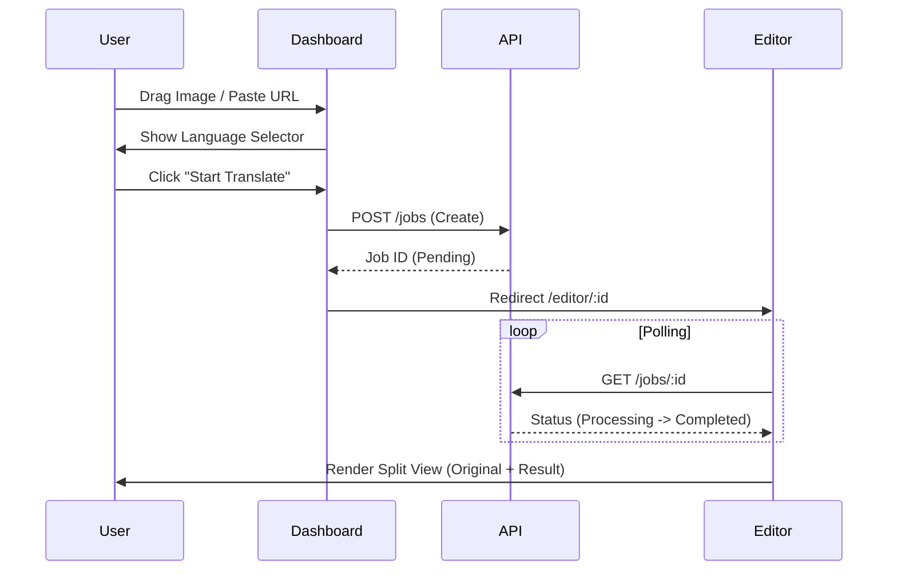
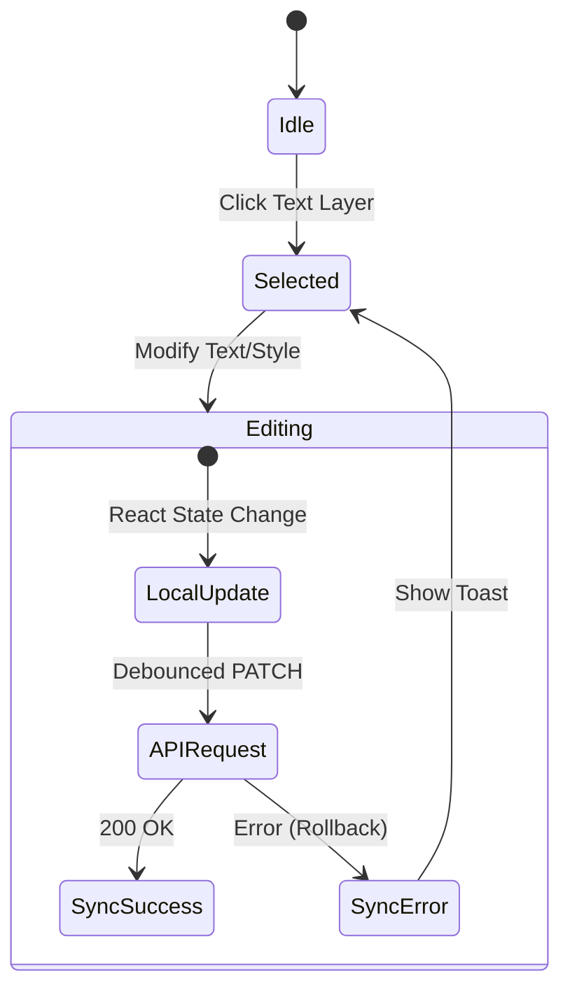
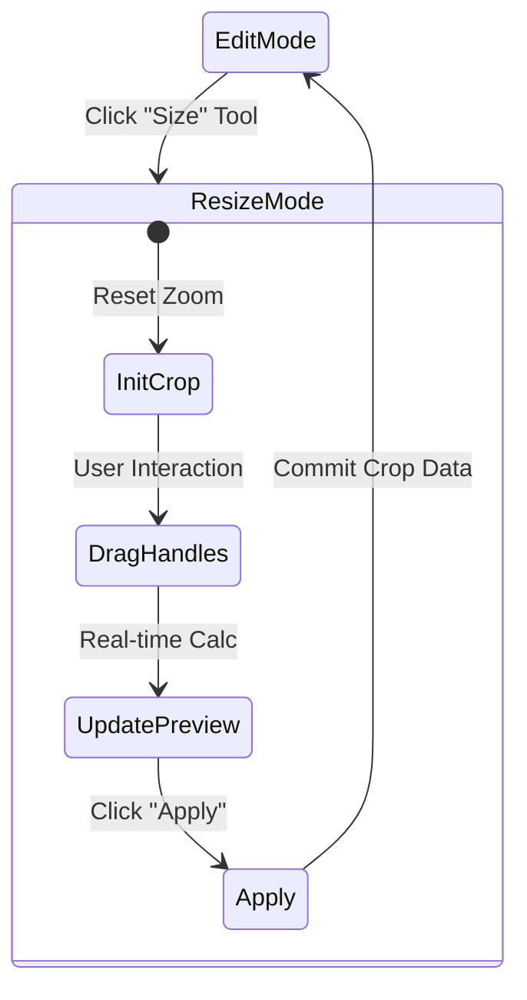

# UI Design Specification (Gemini Phase 2)

> **Role**: Product & Visual Designer
> **Source**: Based on reference `crossborder-ai` design & AGENTS.md standards.
> **Goal**: Replicate the SaaS Dashboard/Editor experience with modern architecture.

---

## 1. Component Tree (Feature Slicing)

### 1.1 Global Layout (`layouts/`)
- **`MainLayout`**
  - `Navbar`: Global branding, user avatar.
  - `Sidebar`: Navigation (Dashboard, History, Settings).
  - `ContentArea`: `<Outlet />` wrapper.
  - **Props**: `user: UserProfile`.

### 1.2 Dashboard Feature (`features/dashboard/`)
*Primary Entry Point: `DashboardPage`*

| Component | Description | Props/State |
|-----------|-------------|-------------|
| `UploadZone` | Drag & drop area + URL input. | `onFileSelect: (file) => void` |
| `LanguageSelector` | Source -> Target language dropdowns. | `source: Lang, target: Lang, onChange` |
| `ProjectGrid` | Grid container for recent tasks. | `projects: Project[]` |
| `ProjectCard` | Individual task card with status badge. | `project: Project, onClick` |
| `StatusBadge` | Visual indicator (Processing/Done/Failed). | `status: JobStatus` |

### 1.3 Editor Feature (`features/editor/`)
*Primary Entry Point: `EditorPage` (Fullscreen, no Sidebar)*

*   **`EditorLayout`** (State: `activeTool`, `zoom`, `pan`)
    *   **`EditorToolbar`** (Left)
        *   Tools: Select, Text, Eraser, Resize (Crop).
    *   **`EditorHeader`** (Top)
        *   Actions: Back, Download, ZoomIn/Out.
    *   **`Workspace`** (Center - Canvas Area)
        *   **`SplitCanvas`** (Mode: Edit)
            *   `OriginalImage` (Left, Reference)
            *   `TranslatedImage` (Right, Interactive)
                *   `TextLayerOverlay`: Renders `TextLayerBox` components.
                *   `EraserOverlay`: Canvas for eraser paths.
        *   **`CropCanvas`** (Mode: Resize)
            *   `CropOverlay`: Handles for resizing/cropping.
    *   **`PropertyPanel`** (Right)
        *   **`LayerListTab`**: List of all text layers.
        *   **`SettingsTab`**:
            *   `TextEditor`: TextArea for content.
            *   `StyleEditor`: Font, Size, Color, Alignment controls.
            *   `EngineSelector`: Dropdown for translation engine.

### 1.4 History Feature (`features/history/`)
*Primary Entry Point: `HistoryPage`*

- **`HistoryList`**: Virtualized list for performance.
- **`HistoryItem`**: Compact version of ProjectCard.
- **`HistoryFilter`**: Date/Status filtering.

### 1.5 Settings Feature (`features/settings/`)
*Primary Entry Point: `SettingsPage`*

- **`EngineConfig`**: API Keys for different providers (Aliyun, Google).
- **`GeneralConfig`**: Default languages, UI theme.

### 1.6 Shared Components (`shared/components/`)
- `Button` (Variants: primary, secondary, ghost)
- `Modal` (Portal based)
- `Toast` (Provider based)
- `Skeleton` (Loading states)
- `EmptyState` (No data placeholder)

---

## 2. Interaction Flows

### 2.1 Upload & Translate (Happy Path)

### 2.2 Layer Editing (Optimistic UI)

### 2.3 Crop & Resize

---

## 3. Responsive Design Strategy

### 3.1 Breakpoints
- **Mobile**: < 768px
- **Tablet**: 768px - 1024px
- **Desktop**: > 1024px

### 3.2 Layout Adaptations

| Component | Desktop (>1024px) | Mobile (<768px) |
|-----------|-------------------|-----------------|
| **Sidebar** | Fixed Left Column | Bottom Navigation Bar |
| **Editor Canvas** | Split View (Side-by-Side) | Tab View (Switch: Original/Result) |
| **Editor Panel** | Fixed Right Column | Bottom Sheet (Drawer) |
| **Project Grid** | 2/3 Columns | Single Column (List view) |
| **Toolbar** | Left Vertical Strip | Top Horizontal Strip |

### 3.3 Mobile Interactions
- **Zoom/Pan**: Use touch gestures (Pinch to zoom, two-finger pan) instead of Ctrl+Scroll.
- **Layer Selection**: Tapping a text box opens the Bottom Sheet with properties.
- **Crop**: Standard mobile image cropper UX.

---

## 4. Visual Style Guide (Derived from Reference)
- **Colors**:
  - Primary: Blue-600 (`#2563EB`)
  - Background: Gray-50 (`#F8F9FA`) / Gray-100 (`#F3F4F6`)
  - Text: Gray-900 (Headings), Gray-500 (Labels)
- **Typography**:
  - Font: Inter / System Sans.
  - Size: Base 14px, Small 12px.
- **Effects**:
  - Shadows: Soft diffuse shadows (`shadow-xl` for floating panels).
  - Borders: Subtle hairines (`border-gray-200`).
  - Radius: `rounded-xl` for cards/panels.

